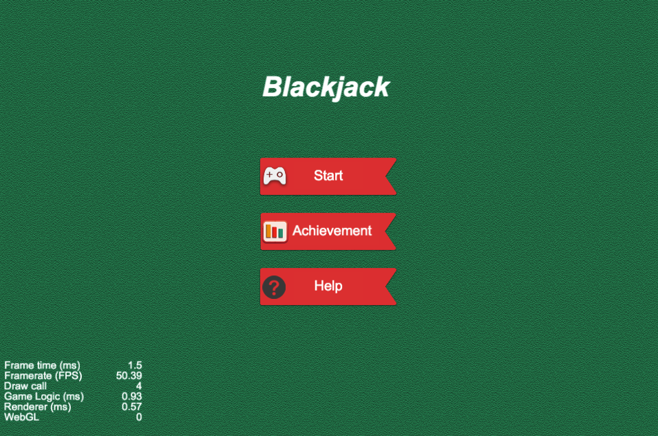
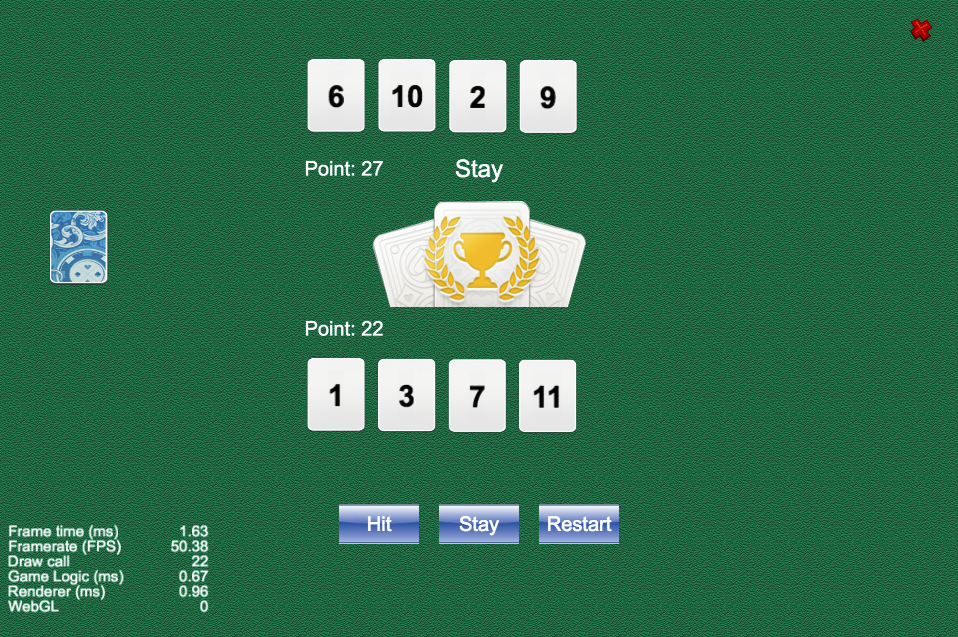

# Requirement

- [Cocos Creator v2.4](https://www.cocos.com/en/creator/download)
- [Node.js v16](https://nodejs.org/en/download/)

# Start

```
cd simple-blackjack
npm install
```

Open it in Cocos Creator.

# Snapshot




